

---

## About me

### Software developer focused on logistics, industrial systems and automation

I build **reliable internal tools, machine integrations and offline-first applications** that simplify real operational workflows.

 

  

**Higher Technician in Web Application Development (DAW)**

> I build software to remove friction from real processes, not just to demonstrate technology.

---

## What I build

  <picture>
    <source media="(max-width: 700px)" srcset="./assets/what-i-build/what-i-build-mobile.svg" type="image/svg+xml" />
    <source srcset="./assets/what-i-build/what-i-build.svg" type="image/svg+xml" />
    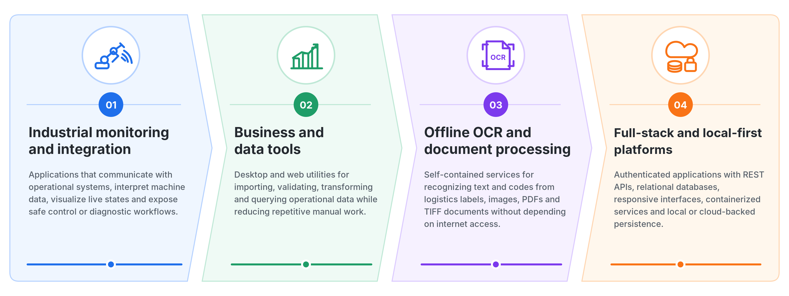
  </picture>

---

## Technology stack

### Languages

  

### Frameworks and application development

  

### Data and messaging

  

### Infrastructure and tools

  

### Computer vision and Windows desktop

  

---

## Selected engineering work

  <picture>
    <source srcset="./assets/project-cards/industrial-tcp-bridge.svg" type="image/svg+xml" />
    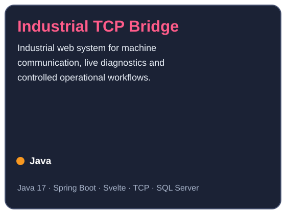
  </picture>
  <picture>
    <source srcset="./assets/project-cards/sorting-system-monitor.svg" type="image/svg+xml" />
    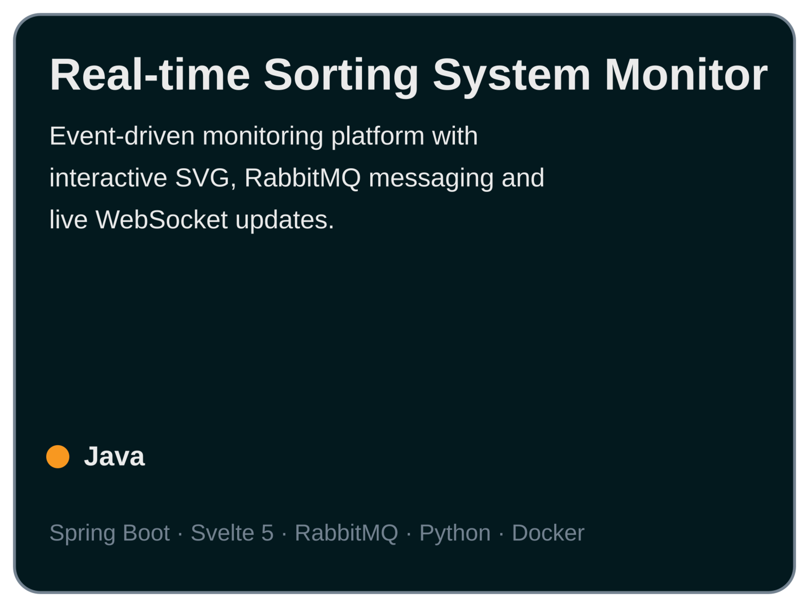
  </picture>
   
  <picture>
    <source srcset="./assets/project-cards/offline-ocr-service.svg" type="image/svg+xml" />
    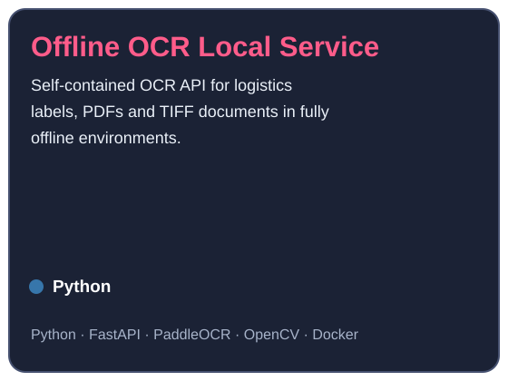
  </picture>
  <picture>
    <source srcset="./assets/project-cards/csv-sql-importer.svg" type="image/svg+xml" />
    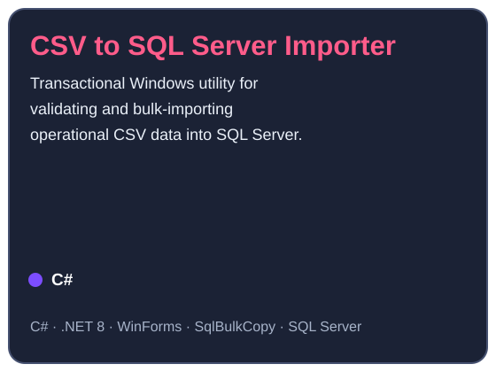
  </picture>
   
  <a href="https://github.com/marcossheredia/Spotify-Tracker">
    <picture>
      <source srcset="./assets/project-cards/spotify-tracker.svg" type="image/svg+xml" />
      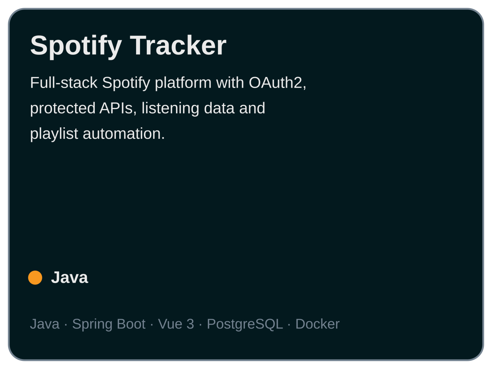
    </picture>
  </a>
  <picture>
    <source srcset="./assets/project-cards/personal-cloud.svg" type="image/svg+xml" />
    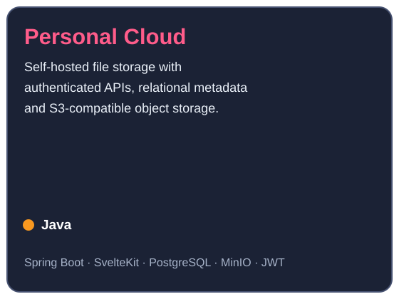
  </picture>

> Public cards open their GitHub repository. Private cards summarize the project without exposing internal implementation details.

---

## Public and personal projects

  <a href="https://github.com/marcossheredia/BanosTres60">
    <picture>
      <source srcset="./assets/project-cards/banos-tres60.svg" type="image/svg+xml" />
      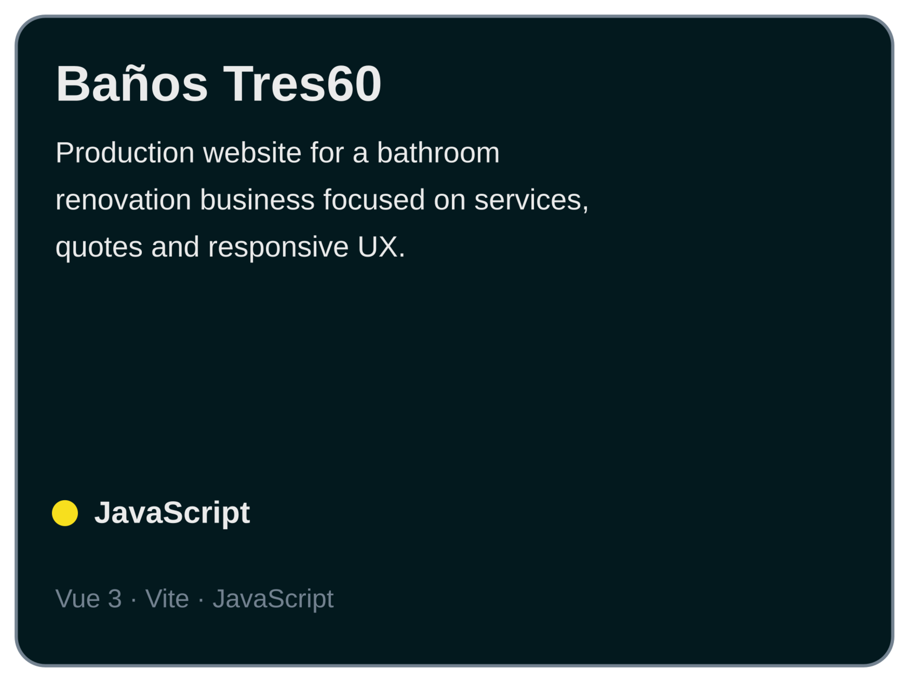
    </picture>
  </a>
  <a href="https://github.com/marcossheredia/FakeStoreApp">
    <picture>
      <source srcset="./assets/project-cards/fakestoreapp.svg" type="image/svg+xml" />
      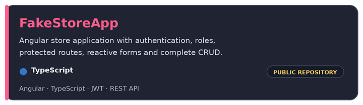
    </picture>
  </a>
   
  <picture>
    <source srcset="./assets/project-cards/mi-tiempo.svg" type="image/svg+xml" />
    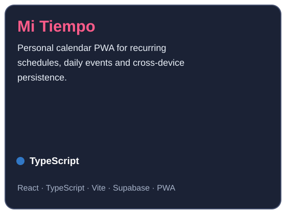
  </picture>
  <picture>
    <source srcset="./assets/project-cards/personal-wishlist.svg" type="image/svg+xml" />
    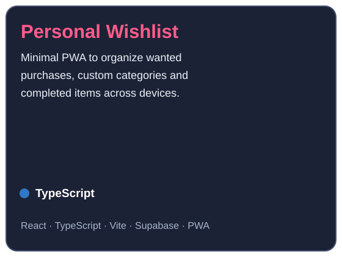
  </picture>

> Private projects are intentionally described without exposing internal addresses, credentials, customer data or company-specific implementation details.

---

## GitHub activity

 

---

**Have a real operational problem that software could simplify? Let's talk.**

