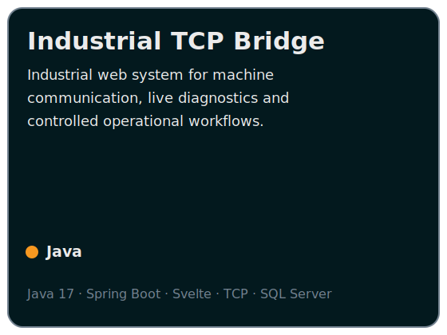
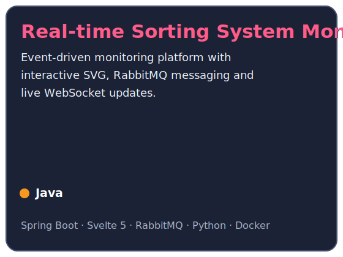
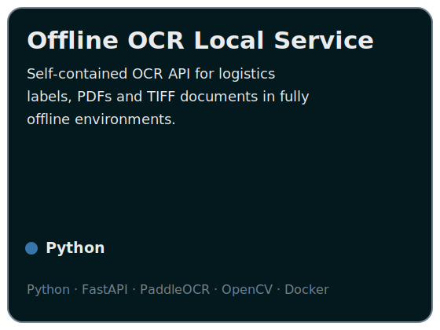
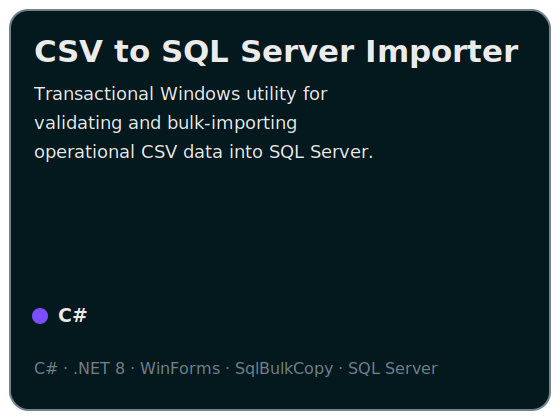
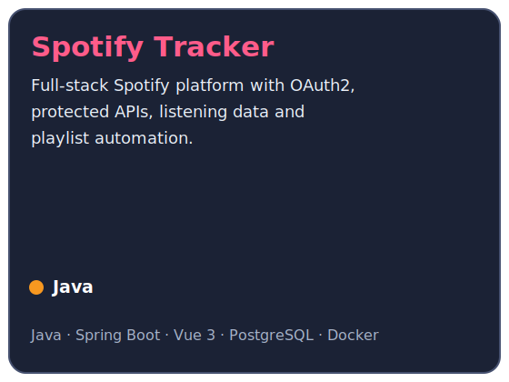
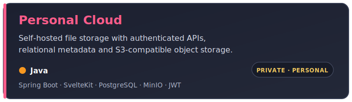
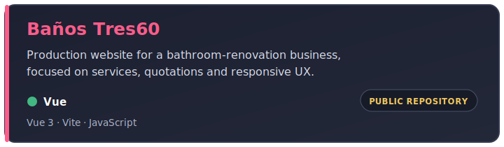
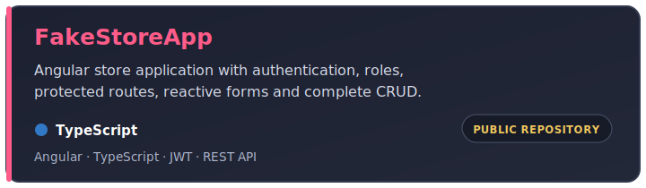
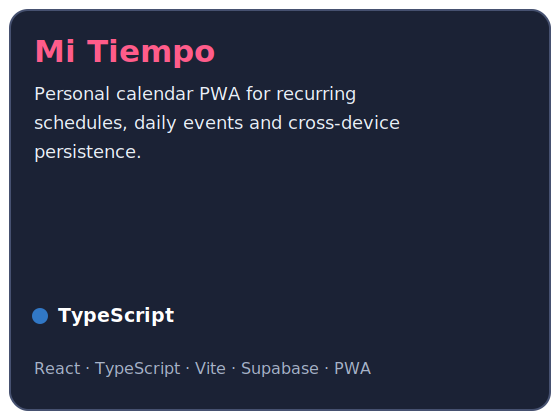
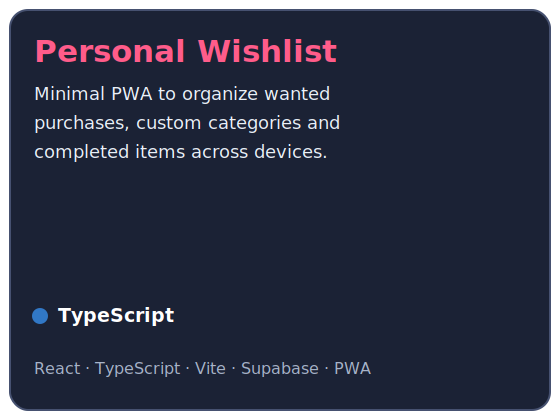

---

## About me

I am a **Software Developer working in the logistics sector**, where I build internal applications and technical solutions for real operational processes.

My work combines backend development, web interfaces, databases and local infrastructure with increasingly industrial use cases: machine communication, live event monitoring, message-driven systems, SQL Server integration and tools designed to operate reliably inside controlled environments.

I graduated as a **Higher Technician in Web Application Development (DAW)** and I currently focus on turning manual or fragmented workflows into maintainable software.

- Developing internal software for **logistics, office operations and industrial environments**
- Building machine-facing integrations using **TCP protocols, RabbitMQ and WebSocket/STOMP**
- Creating backend services and REST APIs with **Java and Spring Boot**
- Developing reactive interfaces with **Svelte, Vue, Angular and React**
- Building offline computer-vision services with **Python, FastAPI, PaddleOCR and OpenCV**
- Creating Windows utilities with **C#, .NET and WinForms/WPF**
- Working with **Microsoft SQL Server, PostgreSQL, MySQL, Supabase and S3-compatible storage**
- Using Docker and Linux-based environments for reproducible local deployments
- Based in Spain

> I am interested in software that removes friction from real processes, not software built only as a technical exercise.

---

## What I build

<table>
<tr>
<td width="50%" valign="top">

### Industrial monitoring and integration

Applications that communicate with operational systems, interpret machine data, visualize live states and expose safe control or diagnostic workflows.

</td>
<td width="50%" valign="top">

### Business and data tools

Desktop and web utilities for importing, validating, transforming and querying operational data while reducing repetitive manual work.

</td>
</tr>
<tr>
<td width="50%" valign="top">

### Offline OCR and document processing

Self-contained services for recognizing text and codes from logistics labels, images, PDFs and TIFF documents without depending on internet access.

</td>
<td width="50%" valign="top">

### Full-stack and local-first platforms

Authenticated applications with REST APIs, relational databases, responsive interfaces, containerized services and local or cloud-backed persistence.

</td>
</tr>
</table>

---

## Technology stack

### Languages

  &nbsp;&nbsp;&nbsp;
  &nbsp;&nbsp;&nbsp;
  &nbsp;&nbsp;&nbsp;
  &nbsp;&nbsp;&nbsp;
  &nbsp;&nbsp;&nbsp;
  &nbsp;&nbsp;&nbsp;
  

### Frameworks and application development

  &nbsp;&nbsp;&nbsp;
  &nbsp;&nbsp;&nbsp;
  &nbsp;&nbsp;&nbsp;
  &nbsp;&nbsp;&nbsp;
  &nbsp;&nbsp;&nbsp;
  &nbsp;&nbsp;&nbsp;
  &nbsp;&nbsp;&nbsp;
  

### Data and messaging

  &nbsp;&nbsp;&nbsp;
  &nbsp;&nbsp;&nbsp;
  &nbsp;&nbsp;&nbsp;
  &nbsp;&nbsp;&nbsp;
  &nbsp;&nbsp;&nbsp;
  

### Infrastructure and tools

  &nbsp;&nbsp;&nbsp;
  &nbsp;&nbsp;&nbsp;
  &nbsp;&nbsp;&nbsp;
  &nbsp;&nbsp;&nbsp;
  <picture>
    <source media="(prefers-color-scheme: dark)" srcset="https://cdn.simpleicons.org/github/FFFFFF" />
    <source media="(prefers-color-scheme: light)" srcset="https://cdn.simpleicons.org/github/181717" />
    
  </picture>&nbsp;&nbsp;&nbsp;
  &nbsp;&nbsp;&nbsp;
  

### Computer vision and Windows desktop

  &nbsp;&nbsp;&nbsp;
  &nbsp;&nbsp;&nbsp;
  &nbsp;&nbsp;&nbsp;
  &nbsp;&nbsp;&nbsp;
  

  PaddleOCR · OpenCV · .NET · WinForms · WPF

### Engineering and integration

  &nbsp;&nbsp;&nbsp;
  &nbsp;&nbsp;&nbsp;
  &nbsp;&nbsp;&nbsp;
  &nbsp;&nbsp;&nbsp;
  &nbsp;&nbsp;&nbsp;
  

  <code>REST APIs</code>&nbsp;&nbsp;·&nbsp;&nbsp;
  <code>WebSocket / STOMP</code>&nbsp;&nbsp;·&nbsp;&nbsp;
  <code>AMQP</code>&nbsp;&nbsp;·&nbsp;&nbsp;
  <code>TCP STX/ETX</code>&nbsp;&nbsp;·&nbsp;&nbsp;
  <code>OAuth2</code>&nbsp;&nbsp;·&nbsp;&nbsp;
  <code>JWT</code>

---

## Selected engineering work

  
  
  
  
  
  

> Public cards open their GitHub repository. Private cards summarize the project without exposing internal implementation details.

---

## Public and personal projects

  
  
  
  

> Private projects are intentionally described without exposing internal addresses, credentials, customer data or company-specific implementation details.

---

## GitHub activity

 

---

**Have a real operational problem that software could simplify? Let's talk.**

